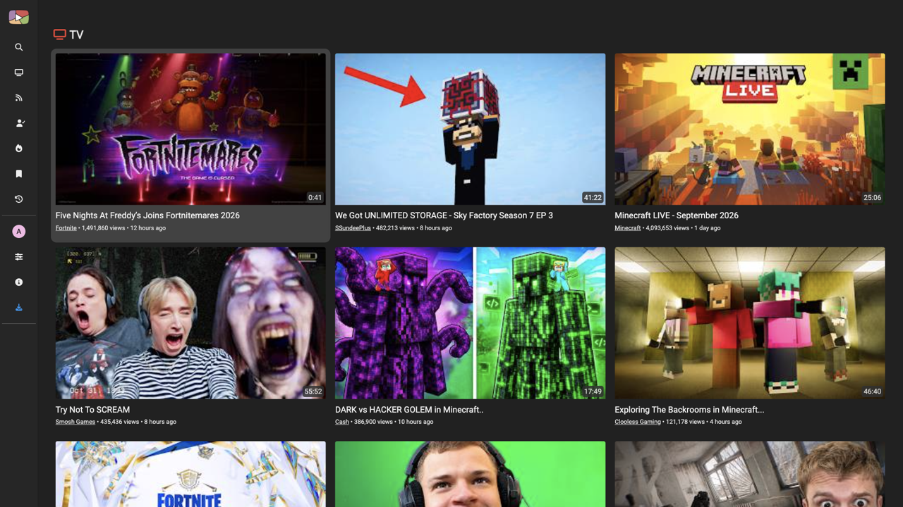
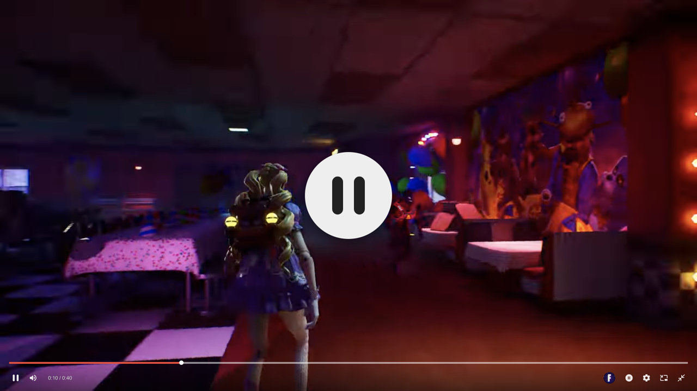
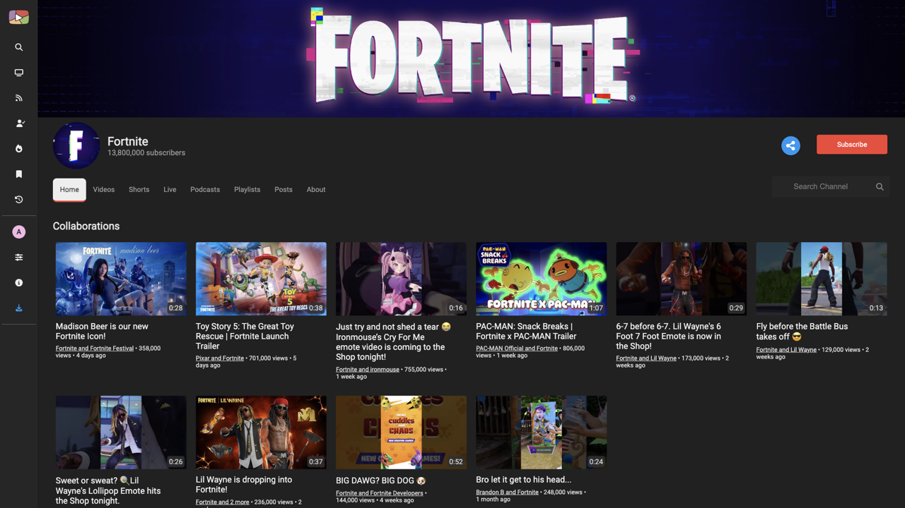

<p align="center" >
 
</p>
<h2 align='center'>
An open source YouTube player for Android TV, built with privacy in mind.
</h2>

> [!WARNING]
> This vibe-coded piece of garbage brings FreeTube to Android TV. It looks nice, but use at your own discretion!
>
> This project **is not maintained and will likely never be maintained**. Issues and pull requests may go unanswered. If you want something dependable, use [FreeTube](https://github.com/FreeTubeApp/FreeTube) or [FreeTube Android](https://github.com/MarmadileManteater/FreeTubeCordova) instead.

<hr>
<p align="center"><a href="#screenshots">Screenshots</a> &bull; <a href="#how-does-it-work">How does it work?</a> &bull; <a href="#features">Features</a> &bull; <a href="#how-to-build-and-test">Building and testing</a> &bull; <a href="#contributing">Contributing</a> &bull; <a href="#localization">Localization</a> &bull; <a href="#contact">Contact</a> &bull; <a href="#donations">Donate</a> &bull; <a href="#license">License</a></p>
<p align="center"><a href="https://freetubeapp.io/">Website</a> &bull; <a href="https://blog.freetubeapp.io/">Blog</a> &bull; <a href="https://docs.freetubeapp.io/">Documentation</a> &bull; <a href="https://docs.freetubeapp.io/faq/">FAQ</a> &bull; <a href="https://github.com/FreeTubeApp/FreeTube/discussions">Discussions</a></p>
<hr>

FreeTube Android TV is an open source YouTube player built with privacy in mind. Use YouTube without advertisements and prevent Google from tracking you with their cookies and JavaScript.
It is a fork of [FreeTube Android](https://github.com/MarmadileManteater/FreeTubeCordova), which is itself a fork of [FreeTube](https://github.com/FreeTubeApp/FreeTube).

> [!NOTE]
> The UI was redone to be TV remote friendly. Everything can be reached with the D-pad and the OK/Back buttons: spatial navigation between pages, a side navigation drawer, a full screen player with remote controls (seek, volume, settings menu and a button to jump to the video's channel), Up Next videos below the player, iOS-style settings, and an Android TV launcher banner.

<p align="center"><a href="https://github.com/Kuuf/FreeTubeAndroidTV/releases">Download FreeTube Android TV</a></p>

<hr>

## How does it work?
The APK uses a built in extractor to grab and serve data / videos, and can optionally use the [Invidious API](https://github.com/iv-org/invidious). No official YouTube APIs are used to obtain data. Your subscriptions and history are stored locally on your device and are never sent out.

## Features
* Watch videos without ads
* Use YouTube without Google tracking you using cookies and JavaScript
* Subscribe to channels without an account
* Connect to an externally setup proxy such as Tor
* View and search your local subscriptions, playlists and history
* Organize your subscriptions into "Profiles" to create a more focused feed
* Export & import subscriptions
* YouTube Trending
* YouTube Chapters
* Most popular videos page based on the set Invidious instance
* SponsorBlock
* Full Theme support
* Option to show only family friendly content
* Show/hide functionality or elements within the app using the distraction free settings
* TV remote navigation across the whole app
* Full screen player with remote controls, including volume and a channel button

Go to [FreeTube's Documentation](https://docs.freetubeapp.io/) if you'd like to know more about how to operate FreeTube and its features.

## Screenshots
  

## How to build and test
### Commands for the APK
```bash
# 📦 Packs the project using `webpack.android.config.js`
pnpm pack:android
# 🚧 for development
pnpm pack:android:dev
```

> These commands only build the assets necessary for the project located in `android/` to be built. In order to obtain a complete build, you will need to build the project located in `android/` with `gradle`.

### Commands for the PWA
Inherited from FreeTube Android and not tested on this fork.
```bash
# 🐛 Debugs the project using `webpack.web.config.js`
pnpm dev:web
# 📦 Packs the project using `webpack.web.config.js`
pnpm pack:web
```

## Contributing

**NOTICE: THIS FORK IS NOT MAINTAINED. MOST CHANGES SHOULD BE MADE TO [FREETUBE](https://www.github.com/freetubeapp/freetube) OR [FREETUBE ANDROID](https://github.com/MarmadileManteater/FreeTubeCordova).**

Pull requests are welcome, but there is no promise that anyone will review them.

## Localization
<a href="https://hosted.weblate.org/engage/free-tube/">

</a>

If you'd like to localize FreeTube, please send submissions to [FreeTube's weblate](https://hosted.weblate.org/engage/free-tube/).

## Contact
If you have questions, you can make an issue here on GitHub, but it may never be answered.

## Donations
This fork does not take donations. If you enjoy using it, consider supporting the projects it is built on:
* [Liberapay](https://liberapay.com/MarmadileManteater) _(goes to creator of FreeTube Android)_
* Bitcoin Address: `1Lih7Ho5gnxb1CwPD4o59ss78pwo2T91eS` _(goes to upstream FreeTube maintainers)_

## License
[](https://www.gnu.org/licenses/agpl-3.0.html)

FreeTube is Free Software: You can use, study share and improve it at your
will. Specifically you can redistribute and/or modify it under the terms of the
[GNU Affero General Public License](https://www.gnu.org/licenses/agpl-3.0.html) as
published by the Free Software Foundation, either version 3 of the License, or
(at your option) any later version.
